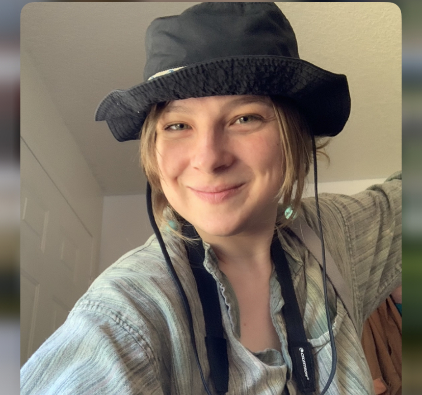

---
title: "GEOG 4/590:  Soil Project"
output: 
  html_document:
    fig_caption: no
    number_sections: no
    toc: no
    toc_float: false
    collapsed: no
---

```{r set-options, echo=FALSE}
options(width = 105)
knitr::opts_chunk$set(dev='png', dpi=300, cache=TRUE)
pdf.options(useDingbats = TRUE)
```
Lyssa Hanson
Data Science  
Univ. Oregon  
ahanson2@uoregon.edu


# The Project:
This project was for a GEOG 490 Special Topics: Earth Science in R at University of Oregon

The Topic was chosen with the hope of experience a different type of data set, made especially interesting with the amount of missing and inconsistent data, as is the nature of a data base containing many different journal publication data and a wide range of studies pertaining to respiration. 
Thank you to Prof. Pat Bartlin for the CSS Styling file


## About Me: ##
Current Student of Data Science at University of Oregon, 
I'm interested in pursing Machine Learning Techniques for 
Computer Vision Technology, and hope to combine geography, computer science, and statistics in future work.


I like mangos, biking, and my two cats: Lilla Borris and Michael Borris.\

{#id .class width=25% height=25%}


The GitHub repository for this web site is at:  
[https://github.com/alyghanson/geog490project](https://github.com/alyghanson/geog490project)