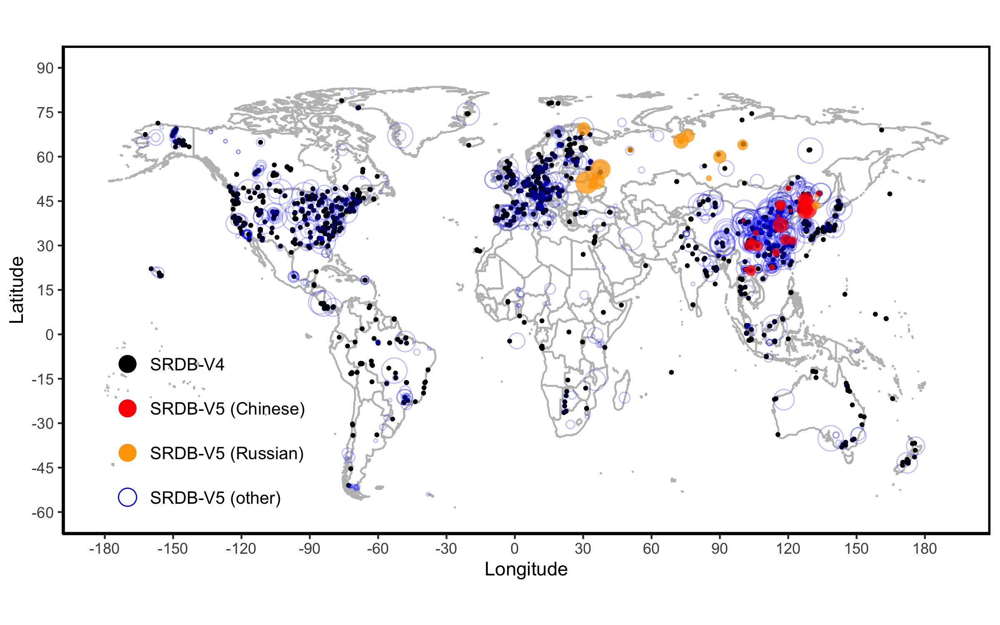

---
title: "Introduction to the project"
output: 
  html_document:
    fig_caption: no
    number_sections: no
    toc: no
    toc_float: false
    collapsed: no
---

```{r set-options, echo=FALSE}
options(width = 105)
knitr::opts_chunk$set(dev='png', dpi=300, cache=TRUE)
pdf.options(useDingbats = TRUE)
```

# About The Global Soil Respiration Database:
{}
A Global Database of Soil Respiration Data (SRDB) was updated in 2021 as Version 5.0 as a project by Oak Ridge National Laboratory. This includes multiple files, the main of which include the data file, contributor information file, and the calculations used to estimate and predict missing values.

The nature of this database is very interesting. The set covers a very broad temporal and spatial scope, containing data from 2,266 publications pertaining to years between 1961 and 2017. This data covers various aspects of the soil respiration process, tracking the levels of carbon dioxide (CO_2) as living materials decompose, information on the biomes, and many other features. Unfortunately, the data (because it is aggregated across many publications) is very inconsistent, this is because some studies may night have documented most of the features shown in this set, while another study may have a very different scientific approach.

In 2017 this data set translated both Chinese and Russian data set additions in an attempt to make the overall data set more representative of the information in journals on soil respiration, this broadened the spatial scope greatly, and in order to tell the story well, I will subset this data set to look at data pertaining to a single country that has the highest frequency of occurrences, and lowest percentace of NULL values.

We will:\
1. Talk about missing values, and how they have changed depending on the temporal aspect.\
2. Inspect the environment of observations, and compare soil respiration levels.\
3. Ask the question - Have those environments changed over time?\


An interesting feature of this data set is that the creators have included Quality flags. This is a very useful feature to us because I can easily drop observations if they are of no use, or if they coincide with an observation that is potentially corrupted in some way.

